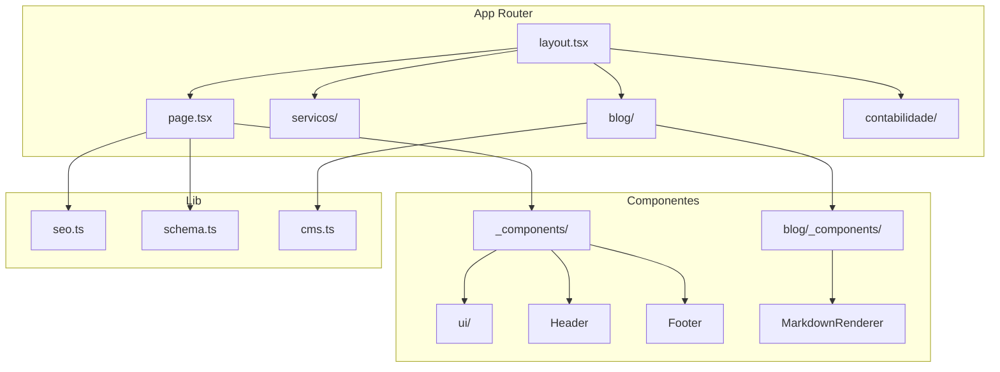
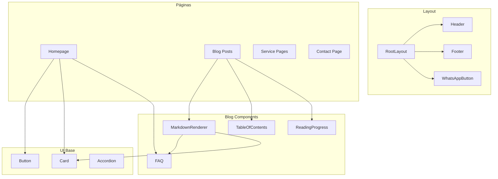
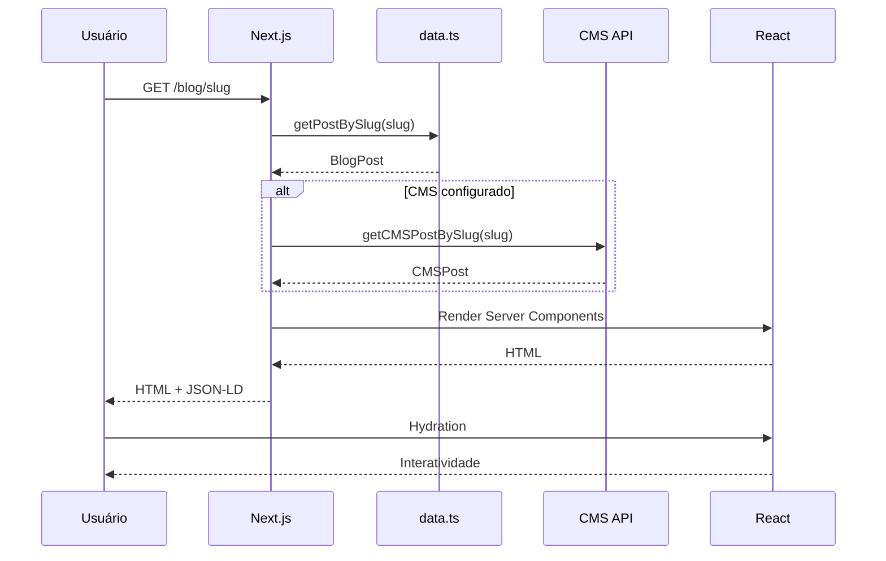
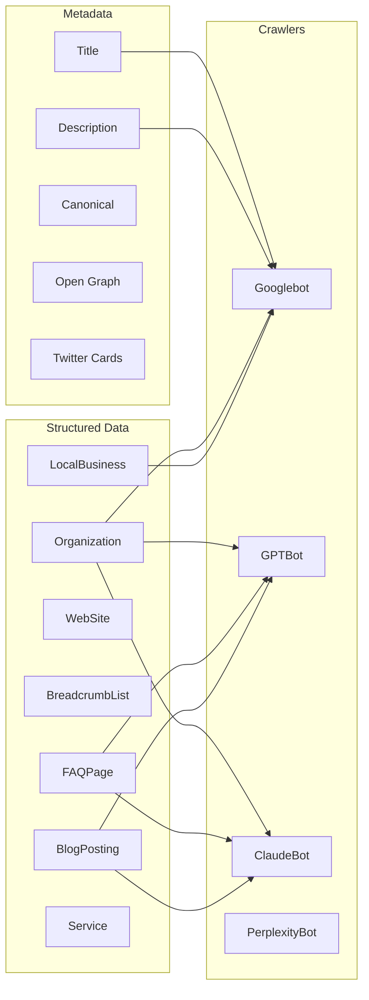

# ENGENHARIA REVERSA COMPLETA: PROJETO ZACONF

**Documento Técnico de Arquitetura e Análise de Sistema**

---

## Sumário

1. [Resumo Executivo](#1-resumo-executivo)
2. [Visão Geral do Projeto](#2-visão-geral-do-projeto)
3. [Estrutura das Pastas](#3-estrutura-das-pastas)
4. [Arquitetura Next.js](#4-arquitetura-nextjs)
5. [Renderização](#5-renderização)
6. [SEO Técnico](#6-seo-técnico)
7. [Sistema de Blog](#7-sistema-de-blog)
8. [Escalabilidade](#8-escalabilidade)
9. [Componentização](#9-componentização)
10. [Performance](#10-performance)
11. [Segurança](#11-segurança)
12. [Qualidade do Código](#12-qualidade-do-código)
13. [Fluxo Completo](#13-fluxo-completo)
14. [Pontos Fortes](#14-pontos-fortes)
15. [Pontos de Melhoria](#15-pontos-de-melhoria)
16. [Diagramas](#16-diagramas)
17. [Conclusão](#17-conclusão)

---

## 1. Resumo Executivo

### Identificação do Projeto

| Atributo | Valor |
|----------|-------|
| **Nome** | ZaconF - Frontend ZACON Contabilidade |
| **Localização** | `/home/rs/Área de trabalho/zacon/Zacon/ZaconF` |
| **Framework** | Next.js 15 (App Router) |
| **React** | React 19 |
| **Linguagem** | TypeScript (strict mode) |
| **Estilização** | Tailwind CSS 4 |
| **Status** | Produção ativa |

### Métricas do Projeto

| Métrica | Valor |
|---------|-------|
| Arquivos TypeScript | 72+ |
| Rotas configuradas | 40+ (estáticas + dinâmicas) |
| Componentes reutilizáveis | 25+ |
| Server Components | ~90% |
| Client Components | ~10% (25 arquivos) |
| Posts do Blog | 33 artigos |
| Schemas JSON-LD | 12+ tipos |
| Keywords SEO | 150+ |

### Principais Destaques

- **Arquitetura moderna** com App Router e React Server Components
- **SEO técnico avançado** com JSON-LD, sitemap dinâmico e GEO
- **Performance otimizada** com SSG, ISR e cache estratégico
- **Integração CMS headless** (FastTeam) preparada
- **Design system premium** inspirado em Stripe/Linear/Vercel
- **Acessibilidade WCAG 2.2 AA** implementada

---

## 2. Visão Geral do Projeto

### 2.1 Objetivo da Aplicação

O ZaconF é o frontend institucional da **ZACON Contabilidade**, escritório de contabilidade localizado em Ingleses, Florianópolis/SC. A aplicação tem como objetivos:

1. **Presença digital profissional** - Site institucional de alta qualidade visual
2. **Geração de leads** - Conversão de visitantes em clientes via WhatsApp/formulários
3. **SEO local agressivo** - Dominar buscas para "contabilidade em Ingleses/Florianópolis"
4. **Autoridade de conteúdo** - Blog técnico para SEO e educação do cliente
5. **GEO (Generative Engine Optimization)** - Otimização para IA (ChatGPT, Perplexity, Claude)

### 2.2 Arquitetura Geral

```
┌─────────────────────────────────────────────────────────────────┐
│                        CAMADA DE APRESENTAÇÃO                    │
│  ┌─────────────────────────────────────────────────────────────┐ │
│  │                    Next.js 15 App Router                    │ │
│  │  ┌─────────────────┐  ┌─────────────────┐  ┌──────────────┐ │ │
│  │  │ Server Components│  │ Client Components│  │  API Routes  │ │ │
│  │  │  (RSC - 90%)    │  │    (10%)        │  │ /api/cms/*   │ │ │
│  │  └─────────────────┘  └─────────────────┘  └──────────────┘ │ │
│  └─────────────────────────────────────────────────────────────┘ │
└─────────────────────────────────────────────────────────────────┘
                                   │
                                   ▼
┌─────────────────────────────────────────────────────────────────┐
│                        CAMADA DE DADOS                          │
│  ┌──────────────────┐  ┌──────────────────┐  ┌────────────────┐ │
│  │  Blog Local      │  │  CMS FastTeam    │  │  lib/ helpers  │ │
│  │  (data.ts)       │  │  (API REST)      │  │  (seo, schema) │ │
│  │  33 posts        │  │  Posts, Páginas  │  │                │ │
│  └──────────────────┘  └──────────────────┘  └────────────────┘ │
└─────────────────────────────────────────────────────────────────┘
                                   │
                                   ▼
┌─────────────────────────────────────────────────────────────────┐
│                        INFRAESTRUTURA                           │
│  ┌──────────────────┐  ┌──────────────────┐  ┌────────────────┐ │
│  │  Vercel/Docker   │  │  CDN (Imagens)   │  │  FastTeam API  │ │
│  │  (standalone)    │  │  AVIF/WebP       │  │  (CMS headless)│ │
│  └──────────────────┘  └──────────────────┘  └────────────────┘ │
└─────────────────────────────────────────────────────────────────┘
```

### 2.3 Stack Tecnológica

#### Dependências de Produção

| Biblioteca | Versão | Propósito |
|------------|--------|-----------|
| `next` | ^15.0.0 | Framework React full-stack |
| `react` | ^19.0.0 | Biblioteca de UI |
| `react-dom` | ^19.0.0 | Renderização DOM |
| `motion` | ^12.43.0 | Animações (ex-Framer Motion) |
| `lucide-react` | ^0.446.0 | Biblioteca de ícones |
| `react-hook-form` | ^7.53.0 | Gerenciamento de formulários |
| `zod` | ^3.23.8 | Validação de schemas |
| `@radix-ui/react-accordion` | ^1.2.0 | Componente acessível |
| `@radix-ui/react-slot` | ^1.1.0 | Pattern asChild |
| `class-variance-authority` | ^0.7.0 | Variantes de componentes |
| `clsx` | ^2.1.0 | Condicionais de classes |
| `tailwind-merge` | ^2.2.0 | Merge de classes Tailwind |
| `react-markdown` | ^10.1.0 | Renderização Markdown |
| `remark-gfm` | ^4.0.1 | GitHub Flavored Markdown |

#### Dependências de Desenvolvimento

| Biblioteca | Versão | Propósito |
|------------|--------|-----------|
| `typescript` | ^5.2.2 | Linguagem tipada |
| `tailwindcss` | ^4.0.0 | Framework CSS |
| `@tailwindcss/postcss` | ^4.0.0 | Plugin PostCSS |
| `@types/react` | ^19.0.0 | Types React |
| `@types/node` | ^20.0.0 | Types Node.js |

### 2.4 Justificativa das Escolhas Tecnológicas

| Tecnologia | Motivo da Escolha |
|------------|-------------------|
| **Next.js 15** | App Router com RSC, melhor SEO, SSG/ISR nativo, edge runtime |
| **React 19** | Concurrent features, Server Components, melhor performance |
| **TypeScript** | Type safety, melhor DX, menos bugs em produção |
| **Tailwind CSS 4** | Nova engine mais rápida, design system consistente |
| **Motion** | Animações declarativas, spring physics, integração React |
| **Radix UI** | Acessibilidade por padrão, unstyled, composável |
| **Zod** | Validação type-safe, integração com react-hook-form |
| **React Markdown** | SSR-friendly, extensível, performático |

### 2.5 Padrão Arquitetural

O projeto segue uma arquitetura **Component-Based** com **Server-First Rendering**:

```
┌────────────────────────────────────────────────────┐
│                    PRINCÍPIOS                       │
├────────────────────────────────────────────────────┤
│ 1. Server Components como padrão (RSC)             │
│ 2. Client Components apenas para interatividade   │
│ 3. Colocation de arquivos (componentes + página)  │
│ 4. Barrel exports para imports limpos             │
│ 5. Separação clara de responsabilidades           │
│ 6. Type-safety rigoroso                           │
│ 7. SEO-first architecture                         │
│ 8. Performance budget consciente                  │
└────────────────────────────────────────────────────┘
```

---

## 3. Estrutura das Pastas

### 3.1 Árvore Completa do Projeto

```
ZaconF/
├── app/                              # App Router (Next.js 15)
│   ├── (seo-local)/                  # Route group (reservado)
│   ├── _components/                  # Componentes globais
│   │   ├── ui/                       # shadcn/ui components
│   │   │   ├── accordion.tsx
│   │   │   ├── button.tsx
│   │   │   └── card.tsx
│   │   ├── AnimatedSection.tsx
│   │   ├── Breadcrumb.tsx
│   │   ├── CurrentYear.tsx
│   │   ├── Footer.tsx
│   │   ├── Header.tsx
│   │   ├── HydrationMarker.tsx
│   │   ├── TipTapRenderer.tsx
│   │   └── WhatsAppButton.tsx
│   ├── api/                          # API Routes
│   │   └── cms/
│   │       ├── revalidate/route.ts   # Webhook revalidação
│   │       └── sync/route.ts         # Sincronização CMS
│   ├── artigo/                       # Posts do CMS
│   │   ├── [slug]/page.tsx
│   │   └── page.tsx
│   ├── blog/                         # Blog local
│   │   ├── _components/              # Componentes específicos
│   │   │   ├── index.ts
│   │   │   ├── ArticleNavigation.tsx
│   │   │   ├── AuthorCard.tsx
│   │   │   ├── BackToTop.tsx
│   │   │   ├── Callout.tsx
│   │   │   ├── Checklist.tsx
│   │   │   ├── ComparisonTable.tsx
│   │   │   ├── FAQ.tsx
│   │   │   ├── InlineCTA.tsx
│   │   │   ├── LegislationBox.tsx
│   │   │   ├── MarkdownRenderer.tsx
│   │   │   ├── ReadingProgress.tsx
│   │   │   ├── RelatedPosts.tsx
│   │   │   ├── ServiceCard.tsx
│   │   │   ├── ShareButtons.tsx
│   │   │   ├── Stats.tsx
│   │   │   ├── TableOfContents.tsx
│   │   │   └── Timeline.tsx
│   │   ├── [slug]/
│   │   │   ├── opengraph-image.tsx
│   │   │   ├── twitter-image.tsx
│   │   │   └── page.tsx
│   │   ├── data.ts                   # Dados dos posts
│   │   └── page.tsx
│   ├── contabilidade/                # SEO Local - Bairros
│   │   └── [bairro]/page.tsx
│   ├── contabilidade-ingleses/       # Página principal SEO
│   │   └── page.tsx
│   ├── contabilidade-para/           # SEO Nichos
│   │   └── [nicho]/page.tsx
│   ├── contato/
│   │   ├── layout.tsx
│   │   └── page.tsx
│   ├── equipe/
│   │   └── [slug]/page.tsx
│   ├── glossario/
│   │   ├── layout.tsx
│   │   └── page.tsx
│   ├── pagina/                       # Páginas do CMS
│   │   └── [slug]/page.tsx
│   ├── perguntas-frequentes/
│   │   └── page.tsx
│   ├── precos/
│   │   └── page.tsx
│   ├── servicos/
│   │   ├── abertura-de-empresas/
│   │   ├── bpo-financeiro/
│   │   ├── contabilidade-empresarial/
│   │   ├── contabilidade-mei/
│   │   ├── departamento-pessoal/
│   │   ├── imposto-de-renda/
│   │   ├── planejamento-tributario/
│   │   ├── regularizacao-empresarial/
│   │   └── page.tsx
│   ├── simulador-simples-nacional/
│   │   ├── layout.tsx
│   │   └── page.tsx
│   ├── apple-icon.tsx
│   ├── error.tsx                     # Error boundary global
│   ├── globals.css
│   ├── icon.tsx
│   ├── layout.tsx                    # Root layout
│   ├── loading.tsx                   # Loading state global
│   ├── manifest.ts
│   ├── not-found.tsx                 # 404 customizado
│   ├── opengraph-image.tsx
│   ├── page.tsx                      # Homepage
│   ├── robots.ts                     # Robots.txt dinâmico
│   ├── sitemap.ts                    # Sitemap dinâmico
│   └── twitter-image.tsx
│
├── lib/                              # Bibliotecas e utilitários
│   ├── cms.ts                        # Cliente API CMS
│   ├── schema.ts                     # JSON-LD schemas
│   ├── seo.ts                        # Configurações SEO
│   ├── seo-local.ts                  # SEO local específico
│   ├── team.ts                       # Dados da equipe
│   └── utils.ts                      # Utilitários gerais
│
├── public/                           # Arquivos públicos
│   ├── images/
│   │   ├── blog/
│   │   ├── certificates/
│   │   ├── office/
│   │   └── team/
│   ├── llms.txt                      # GEO - para crawlers IA
│   └── logo.svg
│
├── docs/                             # Documentação
│
├── .env.example                      # Exemplo variáveis ambiente
├── .env.local                        # Variáveis locais (gitignored)
├── next.config.js                    # Configuração Next.js
├── package.json
├── postcss.config.js
├── tailwind.config.ts                # Design system
└── tsconfig.json                     # TypeScript config
```

### 3.2 Responsabilidades por Pasta

| Pasta | Responsabilidade | Arquivos-chave |
|-------|------------------|----------------|
| `app/` | Rotas, layouts, páginas (App Router) | `layout.tsx`, `page.tsx`, `sitemap.ts` |
| `app/_components/` | Componentes globais reutilizáveis | `Header.tsx`, `Footer.tsx`, `WhatsAppButton.tsx` |
| `app/_components/ui/` | Componentes base shadcn/ui | `button.tsx`, `card.tsx`, `accordion.tsx` |
| `app/api/` | API Routes para webhooks | `revalidate/route.ts` |
| `app/blog/` | Sistema de blog completo | `data.ts`, `[slug]/page.tsx` |
| `app/blog/_components/` | Componentes específicos do blog | `MarkdownRenderer.tsx`, `FAQ.tsx` |
| `app/servicos/` | Landing pages de serviços | 8 páginas individuais |
| `app/contabilidade/` | SEO local por bairro | `[bairro]/page.tsx` |
| `app/contabilidade-para/` | SEO por nicho profissional | `[nicho]/page.tsx` |
| `lib/` | Funções utilitárias e helpers | `seo.ts`, `schema.ts`, `cms.ts` |
| `public/` | Assets estáticos | `llms.txt`, imagens |

### 3.3 Relações Entre Pastas



---

## 4. Arquitetura Next.js

### 4.1 App Router

O projeto utiliza **App Router** do Next.js 15 com a seguinte estrutura:

#### Rotas Estáticas

| Rota | Arquivo | Prioridade Sitemap |
|------|---------|-------------------|
| `/` | `app/page.tsx` | 1.0 |
| `/servicos` | `app/servicos/page.tsx` | 0.9 |
| `/contato` | `app/contato/page.tsx` | 0.9 |
| `/blog` | `app/blog/page.tsx` | 0.8 |
| `/perguntas-frequentes` | `app/perguntas-frequentes/page.tsx` | 0.8 |
| `/precos` | `app/precos/page.tsx` | 0.8 |
| `/glossario` | `app/glossario/page.tsx` | 0.7 |
| `/contabilidade-ingleses` | `app/contabilidade-ingleses/page.tsx` | 0.95 |

#### Rotas Dinâmicas

| Padrão | Arquivo | Propósito |
|--------|---------|-----------|
| `/blog/[slug]` | `app/blog/[slug]/page.tsx` | Posts do blog local |
| `/artigo/[slug]` | `app/artigo/[slug]/page.tsx` | Posts do CMS |
| `/pagina/[slug]` | `app/pagina/[slug]/page.tsx` | Páginas do CMS |
| `/contabilidade/[bairro]` | `app/contabilidade/[bairro]/page.tsx` | SEO local |
| `/contabilidade-para/[nicho]` | `app/contabilidade-para/[nicho]/page.tsx` | SEO nichos |
| `/equipe/[slug]` | `app/equipe/[slug]/page.tsx` | Biografias |
| `/servicos/[servico]` | `app/servicos/*/page.tsx` | 8 serviços |

#### Route Groups

```
app/
├── (seo-local)/          # Route group vazio - reservado para futuro
│                         # Não afeta URL, organiza apenas no código
```

### 4.2 Layouts

#### Root Layout (`app/layout.tsx`)

```typescript
// Estrutura do Root Layout
export default function RootLayout({ children }) {
  return (
    <html lang="pt-BR">
      <head>
        {/* Preconnect para fonts */}
        {/* JSON-LD Schemas globais */}
      </head>
      <body className={plusJakartaSans.variable}>
        <Header />
        <main>{children}</main>
        <Footer />
        <WhatsAppButton />
      </body>
    </html>
  )
}
```

**Schemas injetados no Root Layout:**
- `Organization` (AccountingService)
- `LocalBusiness`
- `Website`

#### Nested Layouts

| Layout | Arquivo | Propósito |
|--------|---------|-----------|
| Contato | `app/contato/layout.tsx` | ContactPage schema + Breadcrumb |
| Glossário | `app/glossario/layout.tsx` | Metadata específica |
| Simulador | `app/simulador-simples-nacional/layout.tsx` | Layout da ferramenta |

### 4.3 Loading States

**Loading Global** (`app/loading.tsx`):

```typescript
export default function Loading() {
  return (
    <div className="min-h-screen flex items-center justify-center">
      {/* Logo animado com pulse */}
      <div className="animate-pulse">
        <span className="text-3xl font-bold text-white">Z</span>
      </div>
      {/* Dots animados */}
      <div className="flex gap-2">
        <div className="animate-bounce [animation-delay:-0.3s]" />
        <div className="animate-bounce [animation-delay:-0.15s]" />
        <div className="animate-bounce" />
      </div>
    </div>
  )
}
```

### 4.4 Error Boundaries

**Error Boundary Global** (`app/error.tsx`):

```typescript
"use client"

export default function Error({ error, reset }) {
  useEffect(() => {
    console.error("Application error:", error)
  }, [error])

  return (
    <section>
      <h1>Algo deu errado</h1>
      <p>Ocorreu um erro inesperado.</p>
      <Button onClick={reset}>Tentar Novamente</Button>
      <Button asChild>
        <Link href="/">Voltar ao Início</Link>
      </Button>
      {/* CTA WhatsApp */}
    </section>
  )
}
```

**404 Customizado** (`app/not-found.tsx`):

```typescript
export const metadata = constructMetadata({
  title: "Página não encontrada",
  noIndex: true  // Não indexar 404
})

export default function NotFound() {
  return (
    <section>
      <span className="text-[200px]">404</span>
      <h1>Página não encontrada</h1>
      {/* Links rápidos + CTA */}
    </section>
  )
}
```

### 4.5 Metadata API

#### Metadata Estática

```typescript
// app/layout.tsx
export const metadata: Metadata = constructMetadata()

export const viewport: Viewport = {
  themeColor: [
    { media: "(prefers-color-scheme: light)", color: "#1E3A8A" },
    { media: "(prefers-color-scheme: dark)", color: "#0F172A" },
  ],
  width: "device-width",
  initialScale: 1,
  maximumScale: 5,
}
```

#### generateMetadata Dinâmica

```typescript
// app/blog/[slug]/page.tsx
export async function generateMetadata({ params }) {
  const post = getPostBySlug(params.slug)

  return constructMetadata({
    title: post.title,
    description: post.excerpt,
    keywords: [...post.keywords, post.category],
    pathname: `/blog/${post.slug}`,
  })
}
```

#### Função Helper SEO

```typescript
// lib/seo.ts
export function constructMetadata({
  title,
  description,
  keywords,
  noIndex,
  pathname,
}: ConstructMetadataProps = {}): Metadata {
  return {
    title: fullTitle,
    description,
    metadataBase: new URL(siteConfig.url),
    alternates: { canonical: `${siteConfig.url}${pathname}` },
    openGraph: {
      type: "website",
      locale: "pt_BR",
      url: `${siteConfig.url}${pathname}`,
      title: fullTitle,
      description,
      siteName: siteConfig.name,
    },
    twitter: {
      card: "summary_large_image",
      title: fullTitle,
      description,
    },
    robots: {
      index: !noIndex,
      follow: !noIndex,
      googleBot: {
        "max-image-preview": "large",
        "max-snippet": -1,
      },
    },
    other: {
      "geo.region": "BR-SC",
      "geo.placename": "Florianópolis",
      "geo.position": "-27.4344;-48.3944",
    },
  }
}
```

### 4.6 generateStaticParams

```typescript
// app/blog/[slug]/page.tsx
export async function generateStaticParams() {
  const posts = getAllPosts()
  return posts.map((post) => ({
    slug: post.slug,
  }))
}

// app/contabilidade/[bairro]/page.tsx
export async function generateStaticParams() {
  return bairros.map((bairro) => ({
    bairro: bairro.slug,
  }))
}

// Permite rotas não pré-renderizadas sob demanda
export const dynamicParams = true
```

### 4.7 Sitemap Dinâmico

**Arquivo:** `app/sitemap.ts`

```typescript
export default async function sitemap(): Promise<MetadataRoute.Sitemap> {
  // Páginas estáticas
  const staticPages = [
    { url: baseUrl, priority: 1 },
    { url: `${baseUrl}/servicos`, priority: 0.9 },
    // ...
  ]

  // SEO Local - Ingleses (PRIORIDADE MÁXIMA)
  const localSeoPages = [
    { url: `${baseUrl}/contabilidade-ingleses`, priority: 0.95 },
  ]

  // Bairros secundários
  const bairroPages = bairros.map((slug) => ({
    url: `${baseUrl}/contabilidade/${slug}`,
    priority: 0.75,
  }))

  // Posts do blog local
  const blogPages = blogPosts.map((post) => ({
    url: `${baseUrl}/blog/${post.slug}`,
    lastModified: new Date(post.dateModified || post.date),
    priority: 0.7,
  }))

  // Conteúdo do CMS (se configurado)
  let cmsPages = []
  if (isCMSConfigured()) {
    const cmsSitemap = await getCMSSitemap()
    // Processa URLs do CMS
  }

  return [...staticPages, ...localSeoPages, ...blogPages, ...cmsPages]
}
```

### 4.8 Robots.txt Dinâmico

**Arquivo:** `app/robots.ts`

```typescript
export default function robots(): MetadataRoute.Robots {
  return {
    rules: [
      {
        userAgent: "*",
        allow: "/",
        disallow: ["/api/", "/_next/", "/opengraph-image", "/twitter-image"],
      },
      // Crawlers de IA (GEO)
      { userAgent: "GPTBot", allow: "/" },
      { userAgent: "ChatGPT-User", allow: "/" },
      { userAgent: "ClaudeBot", allow: "/" },
      { userAgent: "PerplexityBot", allow: "/" },
      { userAgent: "anthropic-ai", allow: "/" },
      { userAgent: "Google-Extended", allow: "/" },
    ],
    sitemap: `${siteConfig.url}/sitemap.xml`,
  }
}
```

### 4.9 Middleware

**Status:** Não utilizado.

O projeto não possui `middleware.ts`. Funcionalidades de middleware são implementadas via:
- **Redirects:** Configurados em `next.config.js`
- **Revalidação:** API Routes `/api/cms/revalidate`
- **Autenticação:** Não aplicável (site público)

### 4.10 Server Components vs Client Components

#### Server Components (90%)

- Todas as `page.tsx` por padrão
- Layouts (`layout.tsx`)
- Componentes estáticos (Cards, Sections)
- Renderizados no servidor, zero JS no cliente

#### Client Components (10% - 25 arquivos)

| Componente | Motivo |
|------------|--------|
| `Header.tsx` | Scroll listener, menu mobile state |
| `WhatsAppButton.tsx` | useState, setTimeout |
| `AnimatedSection.tsx` | IntersectionObserver |
| `FAQ.tsx` | useState para accordion |
| `TableOfContents.tsx` | IntersectionObserver, scroll spy |
| `ReadingProgress.tsx` | useScroll (Motion) |
| `ShareButtons.tsx` | Web Share API |
| `error.tsx` | Error boundaries requerem client |

### 4.11 Cache e Revalidação

#### Estratégias Implementadas

| Estratégia | Uso | Exemplo |
|------------|-----|---------|
| **Static Generation** | Blog local, páginas estáticas | `generateStaticParams()` |
| **ISR (Incremental)** | Conteúdo CMS | `revalidate: 300` (5 min) |
| **On-Demand** | Webhook CMS | `revalidatePath()`, `revalidateTag()` |
| **Cache Tags** | Granularidade fina | `tags: ["cms-posts"]` |

#### Cache Tags Utilizadas

```typescript
// Tags para revalidação seletiva
"cms-posts"          // Todos os posts
"cms-post-{slug}"    // Post específico
"cms-pages"          // Todas as páginas
"cms-page-{slug}"    // Página específica
"cms-categories"     // Categorias
"cms-authors"        // Autores
"cms-sitemap"        // Sitemap
```

#### Webhook de Revalidação

```typescript
// app/api/cms/revalidate/route.ts
export async function POST(request: NextRequest) {
  const { event, content } = await request.json()

  switch (event) {
    case "content.published":
      revalidatePath(`/artigo/${content.slug}`)
      revalidateTag("cms-posts")
      break
    case "content.updated":
      revalidatePath(`/artigo/${content.slug}`)
      break
  }

  return NextResponse.json({ success: true })
}
```

---

## 5. Renderização

### 5.1 Análise por Tipo de Página

| Página | Tipo | Justificativa |
|--------|------|---------------|
| Homepage (`/`) | **SSG** | Conteúdo estático, melhor performance |
| Serviços (`/servicos/*`) | **SSG** | 8 páginas fixas, SEO otimizado |
| Blog local (`/blog/*`) | **SSG** | 33 posts, gerados em build |
| Blog CMS (`/artigo/*`) | **ISR** | Conteúdo dinâmico, 5 min revalidate |
| SEO Local (`/contabilidade/*`) | **SSG** | 6 bairros fixos |
| SEO Nichos (`/contabilidade-para/*`) | **SSG** | 5 nichos fixos |
| Contato (`/contato`) | **SSG + CSR** | Formulário no cliente |
| FAQ (`/perguntas-frequentes`) | **SSG** | Conteúdo estático |
| Preços (`/precos`) | **SSG** | Atualização manual |
| Glossário (`/glossario`) | **SSG + CSR** | Busca no cliente |
| Simulador | **CSR** | Interatividade total |

### 5.2 Fluxo de Renderização SSG

```
┌─────────────────────────────────────────────────────┐
│                    BUILD TIME                        │
├─────────────────────────────────────────────────────┤
│  1. Next.js executa generateStaticParams()          │
│  2. Para cada slug, executa generateMetadata()      │
│  3. Renderiza Server Components                     │
│  4. Gera HTML estático + JSON payload               │
│  5. Armazena em .next/static/                       │
└─────────────────────────────────────────────────────┘
                         │
                         ▼
┌─────────────────────────────────────────────────────┐
│                    RUNTIME                           │
├─────────────────────────────────────────────────────┤
│  1. Request chega ao servidor                       │
│  2. HTML estático servido diretamente (cache)       │
│  3. Client Components hidratam no navegador         │
│  4. Interatividade habilitada                       │
└─────────────────────────────────────────────────────┘
```

### 5.3 Fluxo de Renderização ISR

```
┌─────────────────────────────────────────────────────┐
│                 PRIMEIRA REQUEST                     │
├─────────────────────────────────────────────────────┤
│  1. Se página não existe, gera on-demand            │
│  2. Busca dados do CMS (fetch + cache tags)         │
│  3. Renderiza Server Components                     │
│  4. Cacheia resultado com TTL (revalidate: 300)     │
│  5. Retorna HTML ao usuário                         │
└─────────────────────────────────────────────────────┘
                         │
                         ▼
┌─────────────────────────────────────────────────────┐
│               REQUESTS SUBSEQUENTES                  │
├─────────────────────────────────────────────────────┤
│  Se cache válido (<5 min):                          │
│    → Retorna HTML cacheado imediatamente            │
│                                                      │
│  Se cache expirado:                                 │
│    → Retorna HTML stale (instantâneo)               │
│    → Regenera em background                         │
│    → Próxima request recebe novo HTML               │
└─────────────────────────────────────────────────────┘
                         │
                         ▼
┌─────────────────────────────────────────────────────┐
│               REVALIDAÇÃO ON-DEMAND                  │
├─────────────────────────────────────────────────────┤
│  Webhook CMS → POST /api/cms/revalidate             │
│    → revalidatePath('/artigo/{slug}')               │
│    → revalidateTag('cms-posts')                     │
│    → Próxima request regenera página                │
└─────────────────────────────────────────────────────┘
```

---

## 6. SEO Técnico

### 6.1 Metadata Completo

#### Title Tags

```typescript
// Padrão: "{Título da Página} | ZACON Contabilidade"
// Limite: 50-60 caracteres

// Exemplos:
"ZACON Contabilidade - Contabilidade em Ingleses Florianópolis"
"Como Abrir uma Empresa em Florianópolis: Guia Completo 2026 | ZACON"
"Planejamento Tributário em Florianópolis | ZACON Contabilidade"
```

#### Meta Description

```typescript
// Limite: 150-160 caracteres
// Inclui: benefício + localização + CTA implícito

description: "Escritório de contabilidade em Ingleses, Florianópolis.
Abertura de empresas, BPO financeiro, folha de pagamento.
Atendimento personalizado desde 2009."
```

#### Canonical URLs

```typescript
// Todas as páginas têm canonical explícito
alternates: {
  canonical: `https://zacon.com.br${pathname}`
}
```

#### Robots Tags

```typescript
robots: {
  index: true,
  follow: true,
  googleBot: {
    index: true,
    follow: true,
    "max-image-preview": "large",
    "max-snippet": -1,
  },
}
```

#### Geo Tags (SEO Local)

```typescript
other: {
  "geo.region": "BR-SC",
  "geo.placename": "Florianópolis",
  "geo.position": "-27.4344;-48.3944",
  "ICBM": "-27.4344, -48.3944",
}
```

### 6.2 Open Graph

```typescript
openGraph: {
  type: "website",
  locale: "pt_BR",
  url: "https://zacon.com.br/servicos/abertura-de-empresas",
  title: "Abertura de Empresas em Florianópolis | ZACON",
  description: "...",
  siteName: "ZACON Contabilidade",
  images: [
    {
      url: "/servicos/abertura-de-empresas/opengraph-image",
      width: 1200,
      height: 630,
      alt: "Abertura de Empresas - ZACON Contabilidade",
    }
  ],
}
```

### 6.3 Twitter Cards

```typescript
twitter: {
  card: "summary_large_image",
  title: "Abertura de Empresas em Florianópolis | ZACON",
  description: "...",
  creator: "@zaconcontabilidade",
  images: ["/servicos/abertura-de-empresas/twitter-image"],
}
```

### 6.4 Hierarquia de Headings

**Padrão aplicado em todas as páginas:**

```html
<body>
  <header><!-- Header global --></header>
  <main>
    <h1>Título Principal da Página</h1>  <!-- ÚNICO h1 -->
    <section>
      <h2>Seção 1</h2>
      <h3>Subseção 1.1</h3>
      <h3>Subseção 1.2</h3>
    </section>
    <section>
      <h2>Seção 2</h2>
      <h3>Subseção 2.1</h3>
    </section>
  </main>
  <footer><!-- Footer global --></footer>
</body>
```

**Exemplo Homepage:**

```
h1: "Sua empresa merece uma contabilidade de excelência"
  └── h2: "Uma história de dedicação e confiança"
  └── h2: "Nossos Valores"
        └── h3: "Ética Profissional"
        └── h3: "Confiança Mútua"
  └── h2: "Nossos Serviços"
  └── h2: "Perguntas Frequentes"
```

### 6.5 HTML Semântico

```html
<!-- Estrutura semântica aplicada -->
<body>
  <header role="banner">
    <nav aria-label="Navegação principal">
  </header>

  <main role="main">
    <article><!-- Posts do blog -->
      <header>
        <h1>{title}</h1>
        <time datetime="2026-01-15">{date}</time>
      </header>
      <section><!-- Conteúdo --></section>
      <aside><!-- TOC --></aside>
      <footer><!-- Autor --></footer>
    </article>

    <section aria-labelledby="services-heading">
      <h2 id="services-heading">Serviços</h2>
    </section>
  </main>

  <footer role="contentinfo">
    <nav aria-label="Links do rodapé">
  </footer>
</body>
```

### 6.6 Dados Estruturados (JSON-LD)

#### Organization Schema

```json
{
  "@context": "https://schema.org",
  "@type": ["AccountingService", "ProfessionalService"],
  "@id": "https://zacon.com.br/#organization",
  "name": "ZACON Contabilidade",
  "alternateName": ["ZACON", "ZACON Ingleses"],
  "description": "Escritório de contabilidade em Ingleses...",
  "url": "https://zacon.com.br",
  "logo": { "@type": "ImageObject", "url": "..." },
  "telephone": "+5548988744359",
  "email": "zaconcontabil@gmail.com",
  "foundingDate": "2009",
  "founder": {
    "@type": "Person",
    "name": "Jair Zanette",
    "description": "Fundador (in memoriam)"
  },
  "employee": [{
    "@type": "Person",
    "name": "Jucélia Alves de Lima",
    "jobTitle": "Contadora e Sócia-Diretora",
    "hasCredential": {
      "@type": "EducationalOccupationalCredential",
      "credentialCategory": "professional license",
      "name": "CRC/SC"
    }
  }],
  "address": {
    "@type": "PostalAddress",
    "streetAddress": "Rod. Armando Calil Bulos, 5785",
    "addressLocality": "Florianópolis",
    "addressRegion": "SC",
    "postalCode": "88058-001",
    "addressCountry": "BR"
  },
  "geo": {
    "@type": "GeoCoordinates",
    "latitude": -27.4492,
    "longitude": -48.3989
  },
  "areaServed": [
    { "@type": "City", "name": "Florianópolis" },
    { "@type": "Neighborhood", "name": "Ingleses" }
  ],
  "aggregateRating": {
    "@type": "AggregateRating",
    "ratingValue": "4.9",
    "ratingCount": "28"
  }
}
```

#### LocalBusiness Schema

```json
{
  "@type": "LocalBusiness",
  "name": "ZACON Contabilidade",
  "address": { /* PostalAddress */ },
  "geo": { /* GeoCoordinates */ },
  "openingHoursSpecification": [{
    "@type": "OpeningHoursSpecification",
    "dayOfWeek": ["Monday", "Tuesday", "Wednesday", "Thursday", "Friday"],
    "opens": "08:00",
    "closes": "18:00"
  }]
}
```

#### BreadcrumbList Schema

```json
{
  "@context": "https://schema.org",
  "@type": "BreadcrumbList",
  "itemListElement": [
    {
      "@type": "ListItem",
      "position": 1,
      "name": "Início",
      "item": "https://zacon.com.br"
    },
    {
      "@type": "ListItem",
      "position": 2,
      "name": "Blog",
      "item": "https://zacon.com.br/blog"
    },
    {
      "@type": "ListItem",
      "position": 3,
      "name": "Como Abrir uma Empresa",
      "item": "https://zacon.com.br/blog/como-abrir-empresa"
    }
  ]
}
```

#### BlogPosting Schema (E-E-A-T)

```json
{
  "@context": "https://schema.org",
  "@type": "BlogPosting",
  "headline": "Como Abrir uma Empresa em Florianópolis",
  "datePublished": "2026-01-15",
  "dateModified": "2026-01-20",
  "author": {
    "@type": "Person",
    "name": "Jucélia Alves de Lima",
    "jobTitle": "Contadora — CRC/SC",
    "url": "https://zacon.com.br/equipe/jucelia",
    "hasCredential": {
      "@type": "EducationalOccupationalCredential",
      "credentialCategory": "professional license",
      "name": "CRC/SC"
    }
  },
  "publisher": {
    "@type": "Organization",
    "name": "ZACON Contabilidade",
    "logo": { "@type": "ImageObject", "url": "..." }
  },
  "wordCount": 2500,
  "keywords": "abrir empresa, CNPJ, Florianópolis",
  "articleSection": "Abertura de Empresas"
}
```

#### FAQPage Schema

```json
{
  "@context": "https://schema.org",
  "@type": "FAQPage",
  "mainEntity": [
    {
      "@type": "Question",
      "name": "Quanto custa abrir uma empresa em Florianópolis?",
      "acceptedAnswer": {
        "@type": "Answer",
        "text": "O custo varia de R$ 500 a R$ 2.000..."
      }
    }
  ]
}
```

#### Service Schema

```json
{
  "@context": "https://schema.org",
  "@type": "Service",
  "name": "Abertura de Empresas em Florianópolis",
  "description": "Constituição de empresas MEI, ME, LTDA...",
  "provider": {
    "@id": "https://zacon.com.br/#organization"
  },
  "areaServed": {
    "@type": "City",
    "name": "Florianópolis"
  },
  "serviceType": "Accounting"
}
```

### 6.7 Performance SEO (Core Web Vitals)

| Métrica | Target | Implementação |
|---------|--------|---------------|
| **LCP** | < 2.5s | Imagens otimizadas, preload fonts |
| **INP** | < 200ms | Server Components, code splitting |
| **CLS** | < 0.1 | Dimensões explícitas em imagens |

#### Implementações para Performance

```typescript
// next/image com dimensões
<Image
  src={partner.image}
  alt={`${partner.name} - ${partner.role}`}
  width={112}
  height={112}
  className="w-full h-full object-cover"
/>

// Font optimization
const plusJakartaSans = Plus_Jakarta_Sans({
  subsets: ["latin"],
  display: "swap",  // Evita FOIT
  preload: true,
})

// Cache agressivo (next.config.js)
headers: [
  {
    source: "/_next/static/:path*",
    headers: [{
      key: "Cache-Control",
      value: "public, max-age=31536000, immutable"
    }]
  }
]
```

### 6.8 SEO para IA (GEO / LLM Optimization)

#### llms.txt (`public/llms.txt`)

```text
# ZACON Contabilidade

## Sobre
Escritório de contabilidade fundado em 2009, localizado em Ingleses, Florianópolis/SC.

## Serviços para Empresas
- Abertura de empresas (MEI, ME, LTDA, SLU)
- Contabilidade empresarial
- BPO financeiro
- Folha de pagamento
- Planejamento tributário
- Regularização empresarial

## Serviços para Pessoas Físicas
- Imposto de Renda
- Consultoria patrimonial

## Equipe
- Jucélia Alves de Lima — Contadora CRC/SC, Sócia-Diretora
- Ricardo Lima — Técnico Contábil, Sócio
- [...]

## Contato
- WhatsApp: (48) 98874-4359
- Email: zaconcontabil@gmail.com
- Endereço: Rod. Armando Calil Bulos, 5785, Ingleses

Última atualização: Julho 2026
```

#### Crawlers de IA Permitidos

```typescript
// robots.ts
{ userAgent: "GPTBot", allow: "/" },
{ userAgent: "ChatGPT-User", allow: "/" },
{ userAgent: "ClaudeBot", allow: "/" },
{ userAgent: "PerplexityBot", allow: "/" },
{ userAgent: "anthropic-ai", allow: "/" },
{ userAgent: "Google-Extended", allow: "/" },
```

#### Estrutura Otimizada para LLMs

1. **FAQs estruturadas** com schema FAQPage em páginas-chave
2. **Conteúdo em blocos autocontidos** (fácil de citar)
3. **Entidades claras** (serviços, equipe, localização)
4. **Dados estruturados ricos** (credenciais, áreas de atuação)

---

## 7. Sistema de Blog

### 7.1 Arquitetura do Blog

```
app/blog/
├── page.tsx                    # Listagem (33 posts)
├── data.ts                     # Array de posts (fonte de dados)
├── [slug]/
│   ├── page.tsx               # Página individual
│   ├── opengraph-image.tsx    # OG image dinâmica
│   └── twitter-image.tsx      # Twitter card
└── _components/
    ├── index.ts               # Barrel export
    ├── MarkdownRenderer.tsx   # Motor de renderização
    ├── TableOfContents.tsx    # TOC com scroll spy
    ├── ReadingProgress.tsx    # Barra de progresso
    ├── ShareButtons.tsx       # Compartilhamento
    ├── RelatedPosts.tsx       # Posts relacionados
    ├── AuthorCard.tsx         # Card do autor
    ├── FAQ.tsx                # Accordion FAQ
    ├── Callout.tsx            # Blocos de destaque
    ├── Timeline.tsx           # Linha do tempo
    ├── Stats.tsx              # Grid de estatísticas
    ├── Checklist.tsx          # Lista de tarefas
    ├── ComparisonTable.tsx    # Tabela comparativa
    ├── LegislationBox.tsx     # Citação de leis
    ├── ServiceCard.tsx        # Card de serviço
    └── InlineCTA.tsx          # CTAs inline
```

### 7.2 Estrutura de Dados dos Posts

```typescript
// app/blog/data.ts
export interface BlogPost {
  slug: string              // URL slug
  title: string             // Título do post
  excerpt: string           // Resumo (description)
  content: string           // Markdown + blocos customizados
  date: string              // Data de publicação
  dateModified?: string     // Última modificação
  author: string            // Nome do autor
  authorRole?: string       // Cargo (CRC/SC)
  authorSlug?: string       // Link para perfil
  authorBio?: string        // Biografia curta
  category: string          // Categoria
  readingTime: string       // "15 min"
  image?: string            // Imagem destacada
  keywords: string[]        // Keywords SEO
  relatedServices?: {       // Serviços relacionados
    title: string
    href: string
  }[]
}

// Total: 33 posts
export const blogPosts: BlogPost[] = [...]
```

### 7.3 Categorias Existentes

| Categoria | Posts | Foco |
|-----------|-------|------|
| Contabilidade Local | 9 | SEO local por região |
| Contabilidade Especializada | 4 | Nichos profissionais |
| Planejamento Tributário | 3 | Otimização fiscal |
| Contabilidade | 3 | Geral |
| Abertura de Empresas | 3 | Constituição empresarial |
| Fiscal | 2 | Obrigações fiscais |
| Tributação | 1 | Regimes tributários |
| MEI | 1 | Microempreendedor |
| Imposto de Renda | 1 | Pessoa física |
| Departamento Pessoal | 1 | RH e folha |
| BPO Financeiro | 1 | Terceirização |

### 7.4 Sistema de Markdown Avançado

#### Blocos Customizados

```markdown
<!-- Sintaxe: :::tipo\nconteúdo\n::: -->

:::dica
Use MEI se faturar até R$ 81 mil/ano
:::

:::atencao
Prazo limite: 30 de abril
:::

:::faq
Quanto custa abrir uma empresa?
---
O custo varia de R$ 500 a R$ 2.000...
:::

:::timeline
Registro|Preparar documentação|1 dia
---
Junta Comercial|Protocolar|2-3 dias
---
Receita Federal|CNPJ|Imediato
:::

:::stats
150+|Empresas atendidas|+15%|Crescimento anual
---
4.9|Avaliação Google|estrelas|
:::

:::lei
Lei 123/2006|Art. 18|Simples Nacional|http://...
:::
```

#### Tipos de Blocos Disponíveis

| Bloco | Uso | Componente |
|-------|-----|------------|
| `dica` | Dicas verdes | `Callout type="dica"` |
| `atencao` | Alertas amarelos | `Callout type="atencao"` |
| `importante` | Infos azuis | `Callout type="importante"` |
| `erro` | Erros vermelhos | `Callout type="erro"` |
| `sucesso` | Sucesso verde | `Callout type="sucesso"` |
| `faq` | Pergunta/Resposta | `FAQSingle` |
| `cta` | Call-to-action | `InlineCTA` |
| `timeline` | Passos sequenciais | `Timeline` |
| `stats` | Métricas | `Stats` |
| `checklist` | Lista de tarefas | `Checklist` |
| `proscons` | Vantagens/Desvantagens | `ComparisonTable` |
| `comparacao` | Tabela comparativa | `ComparisonTable` |
| `lei` | Citação legal | `LegislationBox` |
| `servico` | Card de serviço | `ServiceCard` |

### 7.5 Fluxo de Renderização de Conteúdo

```
┌─────────────────────────────────────────────────────┐
│                 1. SPLIT CONTENT                     │
├─────────────────────────────────────────────────────┤
│  Input: content (markdown string)                    │
│  Output: ContentSegment[]                            │
│    - type: "markdown" | "block"                      │
│    - blockType: "dica" | "faq" | etc                 │
│    - content: string                                 │
└─────────────────────────────────────────────────────┘
                         │
                         ▼
┌─────────────────────────────────────────────────────┐
│                 2. RENDER BLOCKS                     │
├─────────────────────────────────────────────────────┤
│  switch (blockType) {                                │
│    case "dica": return <Callout type="dica" />      │
│    case "faq": return <FAQSingle />                 │
│    case "timeline": return <Timeline />              │
│    // ...10+ tipos                                   │
│  }                                                   │
└─────────────────────────────────────────────────────┘
                         │
                         ▼
┌─────────────────────────────────────────────────────┐
│               3. RENDER MARKDOWN                     │
├─────────────────────────────────────────────────────┤
│  <ReactMarkdown                                      │
│    components={{                                     │
│      h2: ({ children }) => {                         │
│        const id = slugify(children)                  │
│        return <h2 id={id}>{children}</h2>           │
│      },                                              │
│      a: ({ href }) => {                              │
│        const isExternal = href?.startsWith("http")   │
│        return <Link external={isExternal} />         │
│      },                                              │
│      // ...todos os elementos                        │
│    }}                                                │
│  />                                                  │
└─────────────────────────────────────────────────────┘
                         │
                         ▼
┌─────────────────────────────────────────────────────┐
│                 4. COMPOSE                           │
├─────────────────────────────────────────────────────┤
│  return segments.map((segment) => {                  │
│    if (segment.type === "block")                     │
│      return renderBlock(segment)                     │
│    return <ReactMarkdown>{segment.content}</...>    │
│  })                                                  │
└─────────────────────────────────────────────────────┘
```

### 7.6 Integração Blog + CMS

#### Arquitetura de Integração

```
┌─────────────────────────────────────────────────────┐
│                    CMS FastTeam                      │
│  ┌──────────────────────────────────────────────┐   │
│  │  API REST: https://api.fastteam.pro           │   │
│  │  Auth: X-API-Key header                       │   │
│  │  Content: TipTap JSON                         │   │
│  └──────────────────────────────────────────────┘   │
└─────────────────────────────────────────────────────┘
                         │
                         │ HTTP + Cache Tags
                         ▼
┌─────────────────────────────────────────────────────┐
│                    lib/cms.ts                        │
│  ┌──────────────────────────────────────────────┐   │
│  │  cmsFetch<T>(endpoint, { tags, revalidate }) │   │
│  │    - getCMSPosts()                            │   │
│  │    - getCMSPostBySlug(slug)                   │   │
│  │    - getCMSCategories()                       │   │
│  │    - getCMSPageBySlug(slug)                   │   │
│  │    - getCMSSitemap()                          │   │
│  └──────────────────────────────────────────────┘   │
└─────────────────────────────────────────────────────┘
                         │
                         │ Next.js fetch cache
                         ▼
┌─────────────────────────────────────────────────────┐
│                    Páginas                           │
│  ┌─────────────────────┐ ┌────────────────────────┐ │
│  │  /artigo/[slug]     │ │  /pagina/[slug]        │ │
│  │  Posts do CMS       │ │  Páginas do CMS        │ │
│  └─────────────────────┘ └────────────────────────┘ │
│  ┌─────────────────────────────────────────────────┐│
│  │  /sitemap.xml                                   ││
│  │  Combina local + CMS                            ││
│  └─────────────────────────────────────────────────┘│
└─────────────────────────────────────────────────────┘
```

#### Funções Disponíveis

```typescript
// lib/cms.ts

// Posts
getCMSPosts({ page?, per_page?, category?, tag?, featured? })
getCMSPostBySlug(slug: string)

// Categorias
getCMSCategories()
getCMSCategoryBySlug(slug: string)

// Tags
getCMSTags()
getCMSTagBySlug(slug: string)

// Autores
getCMSAuthors()
getCMSAuthorBySlug(slug: string)

// Páginas
getCMSPages()
getCMSPageBySlug(slug: string)

// Sitemap
getCMSSitemap()

// Helpers
isCMSConfigured(): boolean
getCMSMediaUrl(path: string): string
checkCMSConnection(): Promise<boolean>
```

#### Tipos do CMS

```typescript
interface CMSPost {
  id: string
  slug: string
  title: string
  excerpt: string
  content: TipTapContent      // JSON do editor
  featured_image: string | null
  reading_time: number
  view_count: number
  is_featured: boolean
  category: CMSCategory | null
  author: CMSAuthor | null
  tags: CMSTag[]
  seo: CMSSEO
  published_at: string
  updated_at: string
}

interface CMSCategory {
  id: string
  slug: string
  name: string
  description: string
  color: string
  post_count: number
}
```

### 7.7 Componentes do Blog

| Componente | Arquivo | Propósito |
|------------|---------|-----------|
| `MarkdownRenderer` | `MarkdownRenderer.tsx` | Motor de renderização |
| `TableOfContents` | `TableOfContents.tsx` | TOC com scroll spy |
| `ReadingProgress` | `ReadingProgress.tsx` | Barra de progresso |
| `ShareButtons` | `ShareButtons.tsx` | Facebook, Twitter, LinkedIn, WhatsApp |
| `RelatedPosts` | `RelatedPosts.tsx` | 3 posts da mesma categoria |
| `ArticleNavigation` | `ArticleNavigation.tsx` | Prev/Next |
| `AuthorCard` | `AuthorCard.tsx` | Bio completa + credenciais |
| `BackToTop` | `BackToTop.tsx` | Botão flutuante |
| `FAQ` | `FAQ.tsx` | Accordion com schema |
| `Callout` | `Callout.tsx` | 6 tipos de destaque |
| `Timeline` | `Timeline.tsx` | Passos sequenciais |
| `Stats` | `Stats.tsx` | Grid de métricas |
| `Checklist` | `Checklist.tsx` | Lista de tarefas |
| `ComparisonTable` | `ComparisonTable.tsx` | Tabela + ProsCons |
| `LegislationBox` | `LegislationBox.tsx` | Citação legal |
| `ServiceCard` | `ServiceCard.tsx` | CTA para serviço |
| `InlineCTA` | `InlineCTA.tsx` | CTAs inline |

---

## 8. Escalabilidade

### 8.1 Arquitetura Atual

| Aspecto | Implementação | Escalabilidade |
|---------|---------------|----------------|
| **Posts locais** | Array TypeScript | Limitado (rebuild) |
| **Posts CMS** | API + ISR | Alta (dinâmico) |
| **Componentes** | Modulares | Alta (reutilizáveis) |
| **Estilização** | Tailwind CSS | Alta (purge) |
| **Build** | Static Generation | Tempo linear |

### 8.2 Projeção de Escalabilidade

| Cenário | Posts | Build Time | Estratégia |
|---------|-------|------------|------------|
| **Atual** | 33 | ~30s | SSG completo |
| **100 páginas** | 100 | ~1-2 min | SSG + paginação |
| **1.000 páginas** | 1.000 | ~5-10 min | ISR on-demand |
| **10.000 páginas** | 10.000 | N/A | Full ISR + CMS |

### 8.3 Gargalos Identificados

1. **Blog local (data.ts):** Array estático requer rebuild
2. **Sem paginação:** Todos os posts carregam juntos
3. **Sem busca:** Navegação limitada
4. **Sem filtros:** Categorias não navegáveis na UI

### 8.4 Recomendações para Escala

#### Curto Prazo (< 100 posts)

```typescript
// 1. Adicionar paginação
const POSTS_PER_PAGE = 12
export function getPaginatedPosts(page: number) {
  return blogPosts.slice((page - 1) * POSTS_PER_PAGE, page * POSTS_PER_PAGE)
}

// 2. Busca client-side com Fuse.js
import Fuse from 'fuse.js'
const fuse = new Fuse(blogPosts, { keys: ['title', 'excerpt', 'keywords'] })
```

#### Médio Prazo (100-1.000 posts)

```typescript
// Migrar para CMS completo
// 1. Integrar FastTeam completamente
// 2. Configurar ISR para todos os posts
// 3. Implementar generateStaticParams parcial

export async function generateStaticParams() {
  // Apenas os 20 posts mais recentes em build
  const topPosts = await getCMSPosts({ per_page: 20 })
  return topPosts.map(post => ({ slug: post.slug }))
}

// Restante gerado on-demand
export const dynamicParams = true
```

#### Longo Prazo (> 1.000 posts)

```typescript
// 1. Full CMS (zero posts locais)
// 2. ISR com revalidate: 3600 (1h)
// 3. Sitemap paginado
// 4. Edge caching (Vercel/Cloudflare)
// 5. Search com Algolia/Meilisearch
```

### 8.5 Separação de Responsabilidades

```
┌─────────────────────────────────────────────────────┐
│                 CAMADA DE DADOS                      │
│  ┌─────────────────┐  ┌─────────────────────────┐   │
│  │  lib/cms.ts     │  │  app/blog/data.ts       │   │
│  │  (CMS client)   │  │  (fallback local)       │   │
│  └─────────────────┘  └─────────────────────────┘   │
└─────────────────────────────────────────────────────┘
                         │
┌─────────────────────────────────────────────────────┐
│                 CAMADA DE LÓGICA                     │
│  ┌─────────────────┐  ┌─────────────────────────┐   │
│  │  lib/seo.ts     │  │  lib/schema.ts          │   │
│  │  (metadata)     │  │  (structured data)      │   │
│  └─────────────────┘  └─────────────────────────┘   │
└─────────────────────────────────────────────────────┘
                         │
┌─────────────────────────────────────────────────────┐
│               CAMADA DE APRESENTAÇÃO                 │
│  ┌─────────────────┐  ┌─────────────────────────┐   │
│  │  app/blog/      │  │  app/_components/       │   │
│  │  (páginas)      │  │  (UI reutilizável)      │   │
│  └─────────────────┘  └─────────────────────────┘   │
└─────────────────────────────────────────────────────┘
```

---

## 9. Componentização

### 9.1 Estrutura de Componentes

```
Componentes/
├── Globais (app/_components/)
│   ├── Layout
│   │   ├── Header.tsx        # Client - scroll, menu
│   │   └── Footer.tsx        # Server - estático
│   ├── UI Base (ui/)
│   │   ├── button.tsx        # 10 variantes
│   │   ├── card.tsx          # 6 variantes
│   │   └── accordion.tsx     # Radix-based
│   ├── Interação
│   │   ├── WhatsAppButton.tsx
│   │   └── AnimatedSection.tsx
│   └── SEO
│       ├── Breadcrumb.tsx
│       └── CurrentYear.tsx
│
└── Blog (app/blog/_components/)
    ├── Conteúdo
    │   ├── MarkdownRenderer.tsx
    │   ├── Callout.tsx
    │   ├── FAQ.tsx
    │   ├── Timeline.tsx
    │   └── Stats.tsx
    └── UX
        ├── TableOfContents.tsx
        ├── ReadingProgress.tsx
        └── ShareButtons.tsx
```

### 9.2 Padrões Utilizados

#### Compound Components (Cards)

```typescript
// Composição flexível
<Card>
  <CardHeader>
    <CardTitle>Abertura de Empresas</CardTitle>
    <CardDescription>MEI, ME, LTDA</CardDescription>
  </CardHeader>
  <CardContent>
    <p>Conteúdo do card</p>
  </CardContent>
  <CardFooter>
    <Button>Saiba Mais</Button>
  </CardFooter>
</Card>
```

#### Variants com CVA

```typescript
// button.tsx
const buttonVariants = cva(
  "inline-flex items-center justify-center rounded-xl font-semibold transition-all",
  {
    variants: {
      variant: {
        default: "bg-zacon-corporate text-white hover:bg-corporate-light",
        premium: "bg-gradient-to-r from-corporate to-accent animate-gradient-shift",
        outline: "border-2 border-zacon-corporate text-corporate",
        ghost: "hover:bg-zacon-light",
        whatsapp: "bg-[#25D366] text-white hover:bg-[#1da851]",
        glass: "bg-white/10 backdrop-blur-md border-white/20",
      },
      size: {
        sm: "h-9 px-4 text-sm",
        default: "h-11 px-6",
        lg: "h-14 px-8 text-lg",
        xl: "h-16 px-10 text-xl",
      },
    },
    defaultVariants: {
      variant: "default",
      size: "default",
    },
  }
)

// Uso
<Button variant="premium" size="xl">
  Solicitar Orçamento
</Button>
```

#### Barrel Exports

```typescript
// app/blog/_components/index.ts
export { Callout, type CalloutType } from "./Callout"
export { FAQ, FAQSingle } from "./FAQ"
export { Timeline, Stepper } from "./Timeline"
export { Stats } from "./Stats"
// ...

// Importação limpa
import { FAQ, Callout, Timeline } from "@/app/blog/_components"
```

### 9.3 Props e Tipagem

```typescript
// Padrão 1: Extends HTMLAttributes
interface CardProps extends React.HTMLAttributes<HTMLDivElement> {
  // Herda todas as props de div
}

// Padrão 2: Generic com forwardRef
const Card = React.forwardRef<
  HTMLDivElement,
  React.HTMLAttributes<HTMLDivElement>
>(({ className, ...props }, ref) => (
  <div ref={ref} className={cn("base-classes", className)} {...props} />
))

// Padrão 3: Union Types para variantes
type CalloutType = "dica" | "atencao" | "importante" | "erro" | "sucesso"

interface CalloutProps {
  type: CalloutType
  children: React.ReactNode
}

// Padrão 4: Record para configuração
const calloutConfig: Record<CalloutType, {
  icon: LucideIcon
  title: string
  bgColor: string
}> = {
  dica: { icon: Lightbulb, title: "Dica", bgColor: "bg-green-50" },
  // ...
}
```

### 9.4 Reutilização

| Componente | Usos | Contextos |
|------------|------|-----------|
| `Button` | 50+ | CTAs, forms, navigation |
| `Card` | 30+ | Services, team, features |
| `AnimatedSection` | 20+ | Homepage, services |
| `Breadcrumb` | 15+ | Todas páginas internas |
| `FAQ` | 10+ | Homepage, services, blog |
| `Callout` | 30+ | Blog posts |

---

## 10. Performance

### 10.1 Otimização de Imagens

```typescript
// next.config.js
images: {
  formats: ["image/avif", "image/webp"],
  deviceSizes: [640, 750, 828, 1080, 1200, 1920],
  imageSizes: [16, 32, 48, 64, 96, 128, 256],
  minimumCacheTTL: 60 * 60 * 24 * 30, // 30 dias
  remotePatterns: [
    { protocol: "https", hostname: "zacon.com.br" },
    { protocol: "https", hostname: "api.fastteam.pro" },
  ],
}
```

**Uso em componentes:**

```typescript
import Image from "next/image"

<Image
  src={partner.image}
  alt={`${partner.name} - ${partner.role} na ZACON`}
  width={112}
  height={112}
  className="object-cover"
  priority={isAboveFold}  // Preload para LCP
/>
```

### 10.2 Code Splitting

```typescript
// Server Components: split automático pelo Next.js
// Client Components: carregados sob demanda

// Dynamic imports para componentes pesados
const Heavy3D = dynamic(() => import('./Heavy3D'), {
  ssr: false,
  loading: () => <Skeleton />
})
```

### 10.3 Cache Headers

```javascript
// next.config.js
async headers() {
  return [
    // Assets estáticos: 1 ano immutable
    {
      source: "/_next/static/:path*",
      headers: [{
        key: "Cache-Control",
        value: "public, max-age=31536000, immutable"
      }]
    },
    // Imagens Next: 30 dias + SWR
    {
      source: "/_next/image/:path*",
      headers: [{
        key: "Cache-Control",
        value: "public, max-age=2592000, stale-while-revalidate=86400"
      }]
    },
    // Fonts: 1 ano
    {
      source: "/fonts/:path*",
      headers: [{
        key: "Cache-Control",
        value: "public, max-age=31536000, immutable"
      }]
    }
  ]
}
```

### 10.4 Font Optimization

```typescript
// app/layout.tsx
import { Plus_Jakarta_Sans } from "next/font/google"

const plusJakartaSans = Plus_Jakarta_Sans({
  subsets: ["latin"],
  display: "swap",          // Evita FOIT
  variable: "--font-plus-jakarta",
  weight: ["400", "500", "600", "700", "800"],
  preload: true,            // Critical
})

// Preconnect no head
<link rel="preconnect" href="https://fonts.googleapis.com" />
<link rel="preconnect" href="https://fonts.gstatic.com" crossOrigin="anonymous" />
```

### 10.5 Bundle Optimization

```javascript
// next.config.js
experimental: {
  optimizePackageImports: [
    "lucide-react",           // Tree-shake ícones
    "@radix-ui/react-accordion",
    "class-variance-authority",
  ],
}
```

### 10.6 Métricas Esperadas

| Métrica | Target | Estratégia |
|---------|--------|------------|
| **LCP** | < 2.5s | Preload fonts/images, SSG |
| **INP** | < 200ms | Server Components, minimal JS |
| **CLS** | < 0.1 | Dimensões explícitas, font-display:swap |
| **TTFB** | < 200ms | Edge caching, static generation |
| **FCP** | < 1.8s | Critical CSS, preconnect |

---

## 11. Segurança

### 11.1 Headers de Segurança

```javascript
// next.config.js
const securityHeaders = [
  {
    key: "X-Frame-Options",
    value: "SAMEORIGIN"
  },
  {
    key: "X-Content-Type-Options",
    value: "nosniff"
  },
  {
    key: "X-XSS-Protection",
    value: "1; mode=block"
  },
  {
    key: "Referrer-Policy",
    value: "strict-origin-when-cross-origin"
  },
  {
    key: "Permissions-Policy",
    value: "camera=(), microphone=(), geolocation=(), interest-cohort=()"
  }
]
```

### 11.2 Content Security Policy (CSP)

```javascript
const cspHeader = [
  "default-src 'self'",
  "script-src 'self' 'unsafe-eval' 'unsafe-inline' https://www.googletagmanager.com",
  "style-src 'self' 'unsafe-inline' https://fonts.googleapis.com",
  "img-src 'self' blob: data: https://api.fastteam.pro",
  "font-src 'self' https://fonts.gstatic.com",
  "connect-src 'self' https://api.fastteam.pro https://wa.me",
  "frame-ancestors 'self'",
  "upgrade-insecure-requests",
].join("; ")
```

### 11.3 Variáveis de Ambiente

```bash
# .env.example
CMS_API_URL=https://api.fastteam.pro
CMS_API_KEY=sua_api_key_aqui           # Nunca commitar
CMS_WEBHOOK_SECRET=seu_webhook_secret  # Nunca commitar

NEXT_PUBLIC_SITE_URL=https://zacon.com.br

# Opcionais
NEXT_PUBLIC_GA_ID=G-XXXXXXXXXX
NEXT_PUBLIC_GTM_ID=GTM-XXXXXXX
```

### 11.4 Validação de Webhook

```typescript
// app/api/cms/revalidate/route.ts
export async function POST(request: NextRequest) {
  const webhookSecret = process.env.CMS_WEBHOOK_SECRET
  const receivedSecret = request.headers.get("x-webhook-secret")

  // Validação obrigatória
  if (receivedSecret !== webhookSecret) {
    return NextResponse.json(
      { error: "Unauthorized" },
      { status: 401 }
    )
  }

  // Continua processamento...
}
```

### 11.5 Sanitização

```typescript
// Conteúdo do CMS é renderizado via TipTapRenderer
// React escapa HTML por padrão
// Markdown é parseado com bibliotecas seguras (react-markdown)

// Formulários validados com Zod
const contactSchema = z.object({
  name: z.string().min(2).max(100),
  email: z.string().email(),
  phone: z.string().regex(/^\d{10,11}$/),
  message: z.string().min(10).max(1000),
})
```

---

## 12. Qualidade do Código

### 12.1 TypeScript Strict Mode

```json
// tsconfig.json
{
  "compilerOptions": {
    "strict": true,
    "noEmit": true,
    "esModuleInterop": true,
    "module": "esnext",
    "moduleResolution": "bundler",
    "resolveJsonModule": true,
    "isolatedModules": true,
    "jsx": "preserve",
    "incremental": true,
    "plugins": [{ "name": "next" }],
    "paths": {
      "@/*": ["./*"]
    }
  }
}
```

### 12.2 Princípios SOLID

| Princípio | Implementação |
|-----------|---------------|
| **S** - Single Responsibility | Cada componente faz uma coisa |
| **O** - Open/Closed | Variantes via props, não modificação |
| **L** - Liskov Substitution | Componentes intercambiáveis |
| **I** - Interface Segregation | Props específicas por componente |
| **D** - Dependency Inversion | Abstrações em lib/ |

### 12.3 Padrões DRY

```typescript
// Helper reutilizado 50+ vezes
import { cn } from "@/lib/utils"

<div className={cn(
  "base-classes",
  variant === "primary" && "variant-classes",
  className
)} />

// Função de WhatsApp reutilizada
import { getWhatsAppLink } from "@/lib/utils"

<a href={getWhatsAppLink(phone, message)}>WhatsApp</a>
```

### 12.4 Clean Code

| Prática | Exemplo |
|---------|---------|
| Nomes descritivos | `getPostBySlug`, `constructMetadata` |
| Funções pequenas | < 30 linhas por função |
| Comentários úteis | Explicam "porquê", não "o quê" |
| Imports organizados | React → Next → Libs → Local |
| Barrel exports | `index.ts` para imports limpos |

---

## 13. Fluxo Completo

### 13.1 Diagrama de Fluxo de Request

```
┌─────────────────────────────────────────────────────────────────┐
│                    USUÁRIO ACESSA O SITE                         │
│                    GET /blog/como-abrir-empresa                  │
└─────────────────────────────────────────────────────────────────┘
                               │
                               ▼
┌─────────────────────────────────────────────────────────────────┐
│                    EDGE/CDN LAYER                                │
│  1. Verifica cache (Vercel Edge)                                 │
│  2. Se HIT: retorna HTML cacheado imediatamente                  │
│  3. Se MISS/STALE: forward para origin                          │
└─────────────────────────────────────────────────────────────────┘
                               │
                               ▼
┌─────────────────────────────────────────────────────────────────┐
│                    NEXT.JS SERVER                                │
│  1. Resolve rota: app/blog/[slug]/page.tsx                      │
│  2. Executa generateStaticParams (se não gerado)                 │
│  3. Executa generateMetadata                                     │
│     - getPostBySlug('como-abrir-empresa')                       │
│     - constructMetadata({ title, description, pathname })       │
└─────────────────────────────────────────────────────────────────┘
                               │
                               ▼
┌─────────────────────────────────────────────────────────────────┐
│                    BUSCA DE DADOS                                │
│  1. getPostBySlug('como-abrir-empresa') → BlogPost              │
│  2. getRelatedPosts(post.category) → BlogPost[]                 │
│  3. Se CMS configurado: await getCMSPostBySlug()                │
└─────────────────────────────────────────────────────────────────┘
                               │
                               ▼
┌─────────────────────────────────────────────────────────────────┐
│                    RENDERIZAÇÃO SERVER                           │
│  1. React Server Components renderizam                           │
│     - Layout.tsx (Header, Footer)                               │
│     - page.tsx (Breadcrumb, Hero, Content, Author)              │
│     - MarkdownRenderer (split + render blocos)                  │
│  2. Client Components marcados para hydration                    │
│     - TableOfContents, ReadingProgress, ShareButtons            │
└─────────────────────────────────────────────────────────────────┘
                               │
                               ▼
┌─────────────────────────────────────────────────────────────────┐
│                    MONTAGEM DA PÁGINA                            │
│  1. HTML base renderizado                                        │
│  2. JSON-LD schemas injetados                                    │
│     - Organization, BlogPosting, BreadcrumbList, FAQPage        │
│  3. Meta tags no <head>                                          │
│     - title, description, canonical, OG, Twitter                │
│  4. CSS crítico inline                                           │
└─────────────────────────────────────────────────────────────────┘
                               │
                               ▼
┌─────────────────────────────────────────────────────────────────┐
│                    ENTREGA DO HTML                               │
│  1. HTML completo enviado ao navegador                           │
│  2. Headers de cache configurados                                │
│  3. Preload hints para JS crítico                               │
│  4. Font preconnect                                              │
└─────────────────────────────────────────────────────────────────┘
                               │
                               ▼
┌─────────────────────────────────────────────────────────────────┐
│                    NAVEGADOR - PARSE                             │
│  1. HTML parseado e exibido (FCP)                               │
│  2. Fonts carregadas (font-display: swap)                       │
│  3. Imagens lazy-loaded                                          │
│  4. LCP marcado (maior elemento visível)                        │
└─────────────────────────────────────────────────────────────────┘
                               │
                               ▼
┌─────────────────────────────────────────────────────────────────┐
│                    HYDRATION                                     │
│  1. React hydrata Client Components                              │
│     - useState inicializado                                      │
│     - useEffect executado                                        │
│     - Event listeners attached                                   │
│  2. Componentes interativos funcionais                           │
│     - TOC scroll spy ativo                                       │
│     - ReadingProgress tracking                                   │
│     - ShareButtons clickáveis                                    │
└─────────────────────────────────────────────────────────────────┘
                               │
                               ▼
┌─────────────────────────────────────────────────────────────────┐
│                    INTERAÇÕES DO USUÁRIO                         │
│  1. Scroll → ReadingProgress atualiza                           │
│  2. Click em heading → TOC highlights                           │
│  3. Click em FAQ → Accordion expande                            │
│  4. Click em Share → Web Share API / Clipboard                  │
│  5. Click em WhatsApp → Abre wa.me                              │
└─────────────────────────────────────────────────────────────────┘
                               │
                               ▼
┌─────────────────────────────────────────────────────────────────┐
│                    INDEXAÇÃO (ASSÍNCRONO)                        │
│  1. Googlebot acessa /blog/como-abrir-empresa                   │
│  2. Renderiza JavaScript (se necessário)                        │
│  3. Extrai:                                                      │
│     - Title, Description, Canonical                             │
│     - JSON-LD (BlogPosting, FAQ, Breadcrumb)                    │
│     - Headings hierarchy (H1 → H2 → H3)                         │
│     - Links internos/externos                                   │
│  4. Indexa página no Google Search                              │
│                                                                  │
│  GPTBot/ClaudeBot/PerplexityBot:                                │
│  5. Acessa página (permitido via robots.txt)                    │
│  6. Extrai conteúdo semântico                                   │
│  7. Usa em respostas de IA                                      │
└─────────────────────────────────────────────────────────────────┘
```

---

## 14. Pontos Fortes

### 14.1 Arquitetura

| Ponto Forte | Descrição |
|-------------|-----------|
| **App Router moderno** | Uso completo do Next.js 15 App Router |
| **Server Components** | 90% RSC, reduz JS no cliente |
| **Colocation** | Componentes próximos ao contexto |
| **Type safety** | TypeScript strict mode |
| **Modularidade** | Separação clara de responsabilidades |

### 14.2 SEO

| Ponto Forte | Descrição |
|-------------|-----------|
| **Metadata completa** | Title, description, canonical, OG, Twitter |
| **JSON-LD robusto** | 12+ tipos de schema implementados |
| **Sitemap dinâmico** | Combina local + CMS automaticamente |
| **GEO implementado** | llms.txt, crawlers de IA permitidos |
| **SEO local** | Páginas por bairro e nicho |
| **E-E-A-T** | Credenciais de autores, expertise demonstrada |

### 14.3 Performance

| Ponto Forte | Descrição |
|-------------|-----------|
| **SSG por padrão** | Páginas estáticas super rápidas |
| **ISR para CMS** | Conteúdo dinâmico sem rebuild |
| **Cache agressivo** | Headers otimizados, 30 dias para imagens |
| **Font optimization** | Preload, display:swap |
| **Image optimization** | AVIF/WebP, lazy loading |

### 14.4 DX (Developer Experience)

| Ponto Forte | Descrição |
|-------------|-----------|
| **CLAUDE.md** | Documentação de convenções do projeto |
| **Path aliases** | `@/*` para imports limpos |
| **Barrel exports** | index.ts para imports organizados |
| **CVA** | Variantes de componentes type-safe |
| **Tailwind config** | Design system completo |

### 14.5 UX

| Ponto Forte | Descrição |
|-------------|-----------|
| **Animações sutis** | Motion + Tailwind animations |
| **Acessibilidade** | ARIA, keyboard nav, reduced motion |
| **Responsividade** | Mobile-first design |
| **WhatsApp CTA** | Conversão facilitada |
| **Error handling** | 404 e Error boundaries customizados |

---

## 15. Pontos de Melhoria

### 15.1 Críticos (Alto Impacto)

| Melhoria | Descrição | Ganho |
|----------|-----------|-------|
| **Paginação do blog** | Implementar paginação (12 posts/página) | Performance, UX |
| **Busca** | Adicionar busca client-side (Fuse.js) | UX, engajamento |
| **Filtros por categoria** | UI para filtrar posts | UX, navegação |
| **Analytics** | Integrar Google Analytics/GTM | Métricas de negócio |
| **Formulário de contato** | Server Action ou API Route | Conversão de leads |

### 15.2 Importantes (Médio Impacto)

| Melhoria | Descrição | Ganho |
|----------|-----------|-------|
| **Integração CMS completa** | Configurar FastTeam em produção | Escalabilidade |
| **Testes automatizados** | Jest + RTL + Playwright | Qualidade |
| **Bundle analysis** | `@next/bundle-analyzer` | Performance |
| **Hooks customizados** | Extrair lógica comum | DRY, manutenção |
| **Skip links** | Adicionar para acessibilidade | a11y WCAG |
| **Comentários no blog** | Sistema de engajamento | Comunidade |

### 15.3 Desejáveis (Baixo Impacto / Nice-to-have)

| Melhoria | Descrição | Ganho |
|----------|-----------|-------|
| **GSAP + Lenis** | Scroll cinematográfico | UX premium |
| **Magic UI** | Componentes visuais avançados | Impacto visual |
| **Storybook** | Documentação de componentes | DX, onboarding |
| **PWA** | Offline reading, install | Mobile UX |
| **AMP** | Versão AMP para mobile | Performance mobile |
| **Dark mode** | Tema escuro | Preferência usuário |
| **i18n** | Multi-idioma (pt-BR/en) | Expansão |

### 15.4 Roadmap Sugerido

```
┌─────────────────────────────────────────────────────┐
│                    FASE 1 (1-2 semanas)              │
├─────────────────────────────────────────────────────┤
│ □ Paginação do blog (12 posts/página)               │
│ □ Busca client-side com Fuse.js                     │
│ □ Filtros por categoria na UI                       │
│ □ Google Analytics 4 integration                    │
└─────────────────────────────────────────────────────┘
                         │
                         ▼
┌─────────────────────────────────────────────────────┐
│                    FASE 2 (2-4 semanas)              │
├─────────────────────────────────────────────────────┤
│ □ Integração CMS FastTeam completa                  │
│ □ Formulário de contato funcional                   │
│ □ Testes unitários (Jest + RTL)                     │
│ □ Skip links e melhorias a11y                       │
└─────────────────────────────────────────────────────┘
                         │
                         ▼
┌─────────────────────────────────────────────────────┐
│                    FASE 3 (1-2 meses)                │
├─────────────────────────────────────────────────────┤
│ □ GSAP + Lenis para scroll cinematográfico          │
│ □ Storybook para documentação                       │
│ □ E2E tests com Playwright                          │
│ □ Bundle optimization                               │
└─────────────────────────────────────────────────────┘
                         │
                         ▼
┌─────────────────────────────────────────────────────┐
│                    FUTURO                            │
├─────────────────────────────────────────────────────┤
│ □ PWA com offline reading                           │
│ □ Dark mode                                         │
│ □ Sistema de comentários                            │
│ □ Newsletter integration                            │
└─────────────────────────────────────────────────────┘
```

---

## 16. Diagramas

### 16.1 Arquitetura de Componentes



### 16.2 Fluxo de Dados do Blog



### 16.3 Estrutura de SEO



---

## 17. Conclusão

### 17.1 Resumo da Análise

O projeto **ZaconF** representa uma implementação **moderna, profissional e bem arquitetada** de um site institucional com blog integrado. A escolha do Next.js 15 com App Router e React Server Components demonstra conhecimento das melhores práticas atuais de desenvolvimento web.

### 17.2 Destaques Técnicos

1. **Arquitetura sólida** com separação clara de responsabilidades
2. **SEO técnico avançado** que posiciona o site para competir em buscas locais
3. **Performance otimizada** com SSG, ISR e cache estratégico
4. **Componentização madura** com padrões reutilizáveis
5. **Preparação para IA** com GEO e crawlers permitidos

### 17.3 Principais Oportunidades

1. Implementar paginação e busca no blog
2. Completar integração com CMS FastTeam
3. Adicionar testes automatizados
4. Configurar analytics de produção

### 17.4 Maturidade do Projeto

| Aspecto | Maturidade |
|---------|------------|
| Arquitetura | ★★★★★ |
| SEO | ★★★★★ |
| Performance | ★★★★☆ |
| Componentização | ★★★★★ |
| Testes | ★★☆☆☆ |
| Documentação | ★★★★☆ |
| Acessibilidade | ★★★★☆ |

### 17.5 Recomendação Final

O projeto está **pronto para produção** e bem posicionado para escalar. As melhorias sugeridas são evolutivas, não bloqueantes. A base de código é limpa, tipada e segue convenções modernas de desenvolvimento React/Next.js.

---

## Anexos

### A. Arquivos de Referência

| Arquivo | Propósito | Localização |
|---------|-----------|-------------|
| `layout.tsx` | Root layout + schemas | `app/layout.tsx` |
| `sitemap.ts` | Sitemap dinâmico | `app/sitemap.ts` |
| `robots.ts` | Robots.txt | `app/robots.ts` |
| `seo.ts` | Helpers SEO | `lib/seo.ts` |
| `schema.ts` | JSON-LD schemas | `lib/schema.ts` |
| `cms.ts` | Cliente CMS | `lib/cms.ts` |
| `data.ts` | Posts do blog | `app/blog/data.ts` |
| `button.tsx` | Componente Button | `app/_components/ui/button.tsx` |
| `card.tsx` | Componente Card | `app/_components/ui/card.tsx` |
| `MarkdownRenderer.tsx` | Motor markdown | `app/blog/_components/MarkdownRenderer.tsx` |
| `tailwind.config.ts` | Design system | `tailwind.config.ts` |
| `next.config.js` | Configuração Next | `next.config.js` |

### B. Comandos Úteis

```bash
# Desenvolvimento
npm run dev           # Inicia servidor dev

# Build
npm run build         # Build de produção
npm run start         # Inicia servidor produção

# Análise
npm run lint          # ESLint
npx @next/bundle-analyzer  # Análise de bundle
```

### C. Variáveis de Ambiente

```bash
# .env.local (produção)
CMS_API_URL=https://api.fastteam.pro
CMS_API_KEY=xxxxxxxxxxxx
CMS_WEBHOOK_SECRET=xxxxxxxxxxxx
NEXT_PUBLIC_SITE_URL=https://zacon.com.br
NEXT_PUBLIC_GA_ID=G-XXXXXXXXXX
```

---

**Documento gerado por:** Claude Code (Opus 4.5)
**Data:** 2026-08-06
**Versão:** 1.0.0

---

*Este relatório foi elaborado para servir como documentação técnica oficial do projeto ZaconF, permitindo que desenvolvedores compreendam sua arquitetura, padrões e funcionamento sem precisar explorar todo o código-fonte.*
